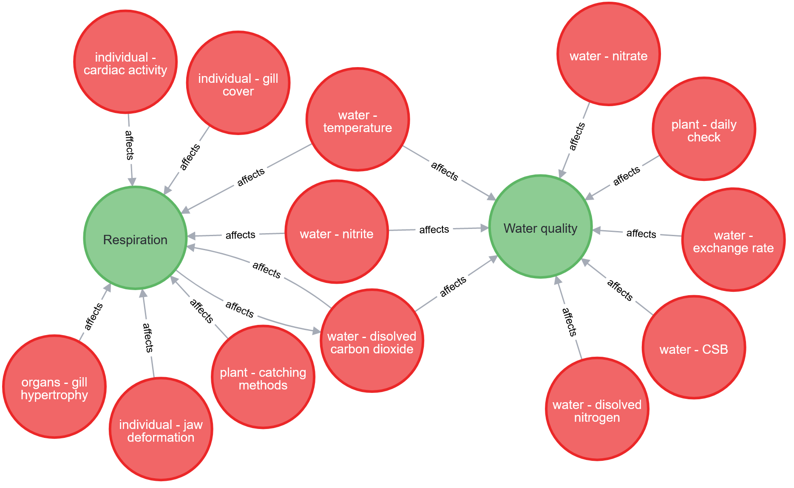

# MyFishCheck-Model
The MyFishCheck Model: Assessing Fish Welfare in Swiss Aquaculture

This domain model, being yet in a draft state, ideally marks the beginning of an aquaculture knowledge framework that is supported, used, and extended by multiple stakeholders in the field.

The ontology [visualized with WebVowl](http://www.visualdataweb.de/webvowl/#iri=https://github.zhaw.ch/raw/AquacultureSystems/MyFishCheckModel/master/FarmCheck.owl?token=AAAAUAUXCIWGXLOX2ZFLYJ27NWTB4). Please note that due to the architecture, there aren't many nodes to see.

Part of the ontology visualized using Neo4j:

## References
The ontology was created with [Protégé](http://protege.stanford.edu) and programmatically manipulated with [python](http://www.python.org)  
The graph was built in [Neo4j[(https://neo4j.com) using the import function of [neosemantics (n10s)](https://neo4j.com/labs/neosemantics/)  
